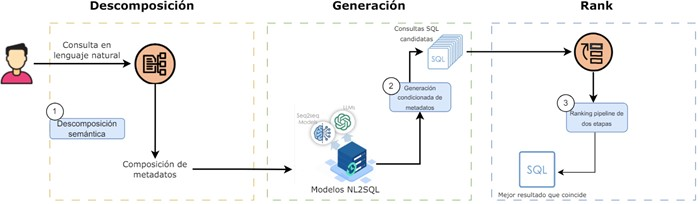

# Optimizacion de la Traduccion de Lenguaje Natural a SQL mediante un Marco de Generacion y Clasificacion

## 📖 Descripcion General

En este codigo, implementaremos:

* Un marco unificado de <strong>generar y clasificar</strong> para mejorar la precision de NL2SQL en comparacion con los modelos existentes (basados en Seq2seq o LLM).

El objetivo de la traduccion NL2SQL es convertir una consulta en lenguaje natural en una consulta SQL.

Aunque los enfoques existentes han mostrado resultados prometedores en benchmarks estandar, las consultas SQL individuales generadas mediante decodificacion auto-regresiva pueden resultar en salidas suboptimas en dos aspectos principales: (1) Falta de diversidad en la salida. La decodificacion auto-regresiva, comunmente utilizada con busqueda en haz o metodos de muestreo, como el muestreo top-k, a menudo tiene dificultades para generar un conjunto diverso de secuencias candidatas y tiende a mostrar repetitividad en sus salidas; (2) Falta de conciencia del contexto global. Debido a la naturaleza incremental de generar tokens de salida uno por uno basandose en los tokens generados previamente, la decodificacion auto-regresiva puede llevar a encontrar optimos locales ya que considera solo un contexto parcial, lo que puede causar que no se encuentre la traduccion correcta.

Para abordar el problema de la insuficiente diversidad en la salida, primero se introducen metadatos de consulta como una senial de control explicita para manipular el comportamiento de los modelos de traduccion para una mejor generacion de consultas SQL candidatas. Ademas, para abordar la falta de contexto global, reformulamos el problema de NL2SQL como un proceso de clasificacion de post-procesamiento (como una senial de control implicita), aprovechando todo el contexto global en lugar de la informacion parcial involucrada en la generacion de secuencias.

### ❓ Como funciona

Seguiremos 3 pasos para la traduccion:

1. **Descomposicion semantica**: Descomponer el significado de una consulta NL dada y mapearla a un conjunto de metadatos de consulta.
2. **Generacion condicionada por metadatos**: Manipular el comportamiento del modelo de traducción para generar una colección de consultas SQL condicionando en diferentes composiciones de los metadatos recuperados.
3. **Pipeline de Clasificacion en dos etapas**: Clasificar basándose en la similitud semántica con una consulta NL dada y encontrar la consulta SQL más cercana como resultado de la traducción.

Este proceso se ilustra en el siguiente diagrama:

